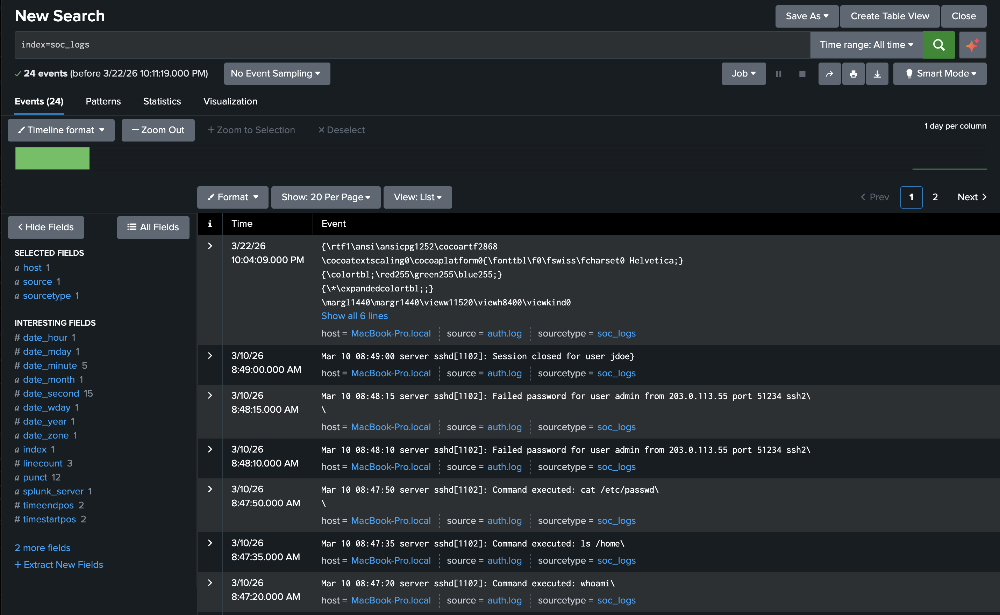
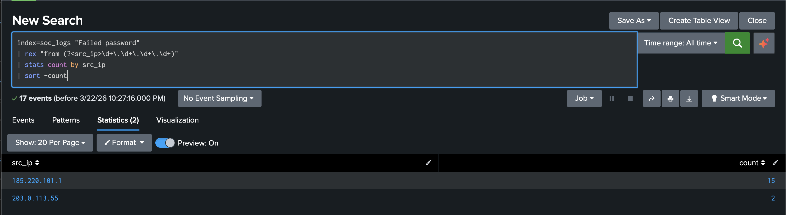
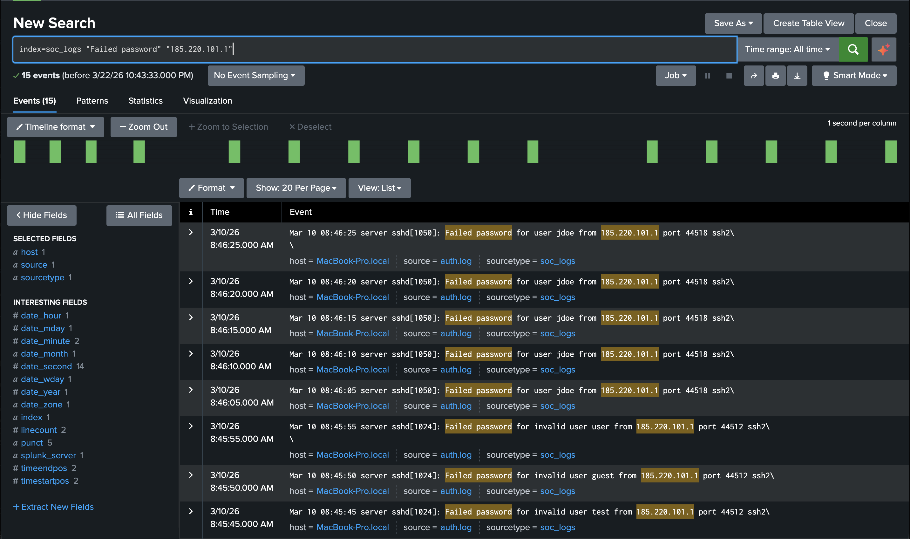
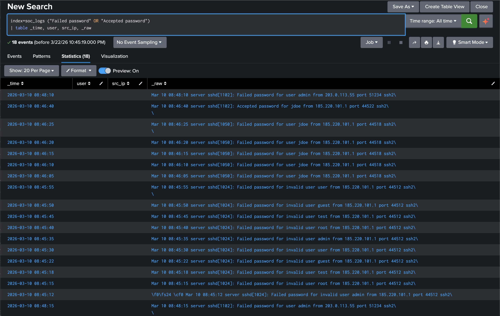
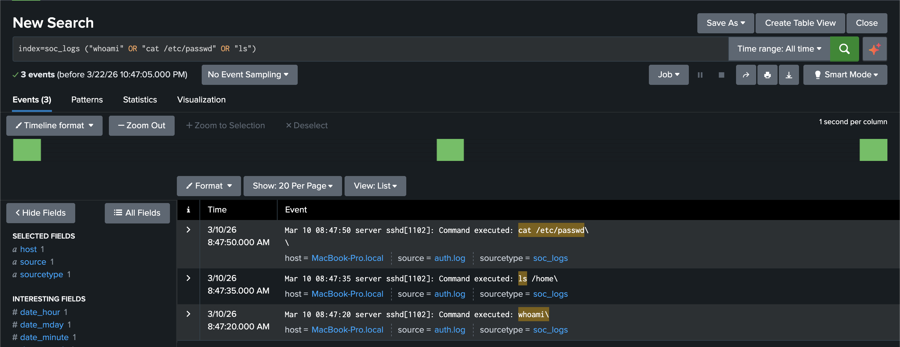
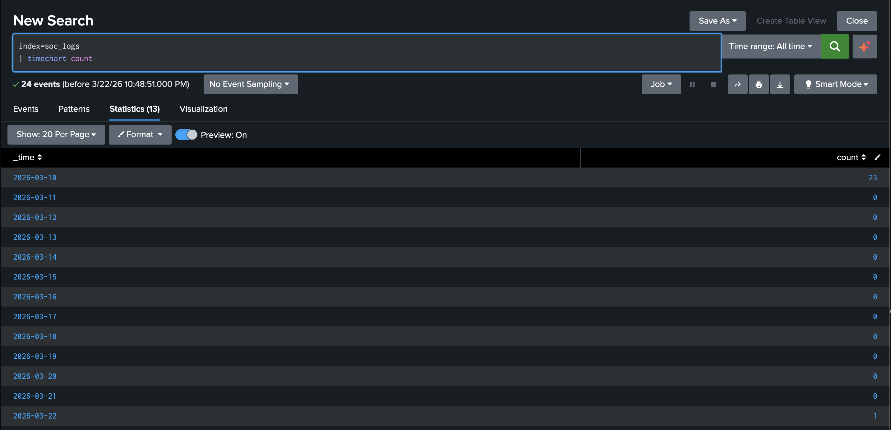
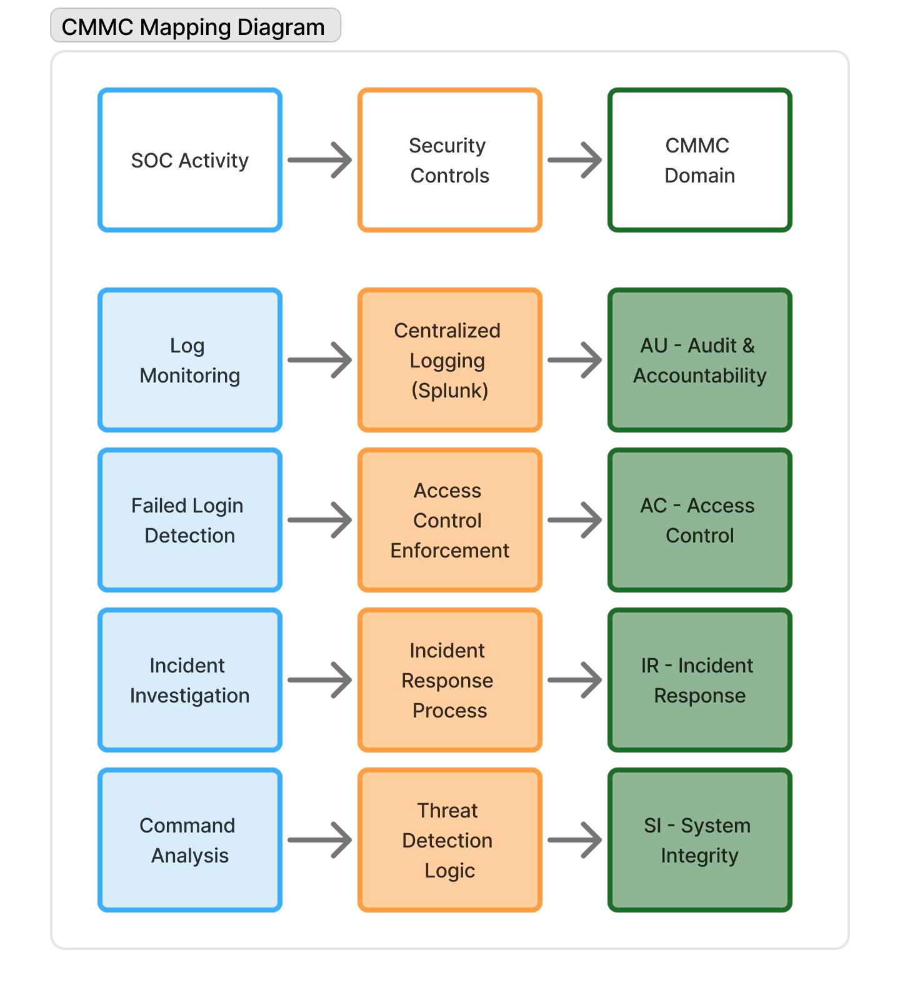

# Home SOC Lab with CMMC Alignment

## Project Type:

Security Operations / SIEM / Incident Response / Compliance Mapping

---

## Overview:

This project simulates a home Security Operations Center (SOC) using Splunk to monitor logs, detect suspicious activity, and investigate a simulated security incident. The lab also aligns detection and monitoring capabilities with CMMC security practices to demonstrate compliance awareness.

This project demonstrates both technical security operations capabilities and the ability to align those activities with compliance frameworks relevant to government and regulated environments.

---

## Simulated Organization:

Organization: QuantumWave Technologies

Industry: Software Development

Employees: 500

---

## Objectives:

- Monitor logs using a SIEM platform

- Detect suspicious activity and potential attacks

- Investigate security incidents

- Simulate SOC workflows

- Map security controls to CMMC

---

## Technologies Used:

- Splunk (SIEM)

- Simulated authentication logs

- [CMMC Framework](https://dodcio.defense.gov/CMMC/About/)

---

## Lab Environment:

- Local Splunk instance

- Simulated log dataset

- Controlled SOC environment

- Regex-based field extraction (Splunk rex)

---

## Ethical Considerations:

All activities were performed in a controlled lab environment using simulated data. No real systems were targeted.

---

## Key Findings:

### 1. Log Ingestion

Log data successfully ingested into Splunk, establishing visibility into authentication events.

---

### 2. Failed Login Detection

Detection of repeated failed login attempts using regex-based field extraction to identify source IP addresses, indicating potential brute-force activity.

---

### 3. Suspicious IP Analysis

Identification of a suspicious IP address responsible for repeated failed login attempts.

---

### 4. Successful Login Detection

Successful authentication detected following repeated failed attempts, indicating potential account compromise.

---

### 5. Command Execution

Commands executed after successful authentication, indicating attacker activity within the system.

---

### 6. Timeline Analysis

Timeline visualization showing a spike in authentication activity during the attack window.

---

## Field Extraction

Since the dataset contained unstructured log data, field extraction was performed using regular expressions to identify key attributes such as source IP addresses. This enabled effective analysis and detection of suspicious activity.

---

## CMMC Alignment

This section demonstrates how SOC activities and technical controls support compliance with CMMC security practices.

### Mapping SOC Activities to CMMC Practices

| CMMC Domain | Implementation                  |
| ----------- | ------------------------------- |
| AC          | Access control policies, MFA    |
| AU          | Logging and monitoring (Splunk) |
| IR          | Incident detection and response |
| SI          | Detection of malicious activity |

---

### Visual Mapping

This diagram illustrates how SOC monitoring and detection activities align with CMMC security practices through implemented controls.

---

## Recommendations:

- Implement automated alerting

- Strengthen monitoring coverage

- Enforce stronger authentication controls

- Regularly review logs

---

## Key Concepts Demonstrated:

- SIEM usage

- Threat detection

- Incident investigation

- SOC workflow

- Compliance alignment

- Field extraction using regular expressions (rex)

---

## Lessons Learned:

- Importance of continuous monitoring

- How attackers behave during compromise

- Value of correlating events

- Role of SIEM in security operations

---

## Future Improvements:

- Integrate real-time alerting

- Expand dataset

- Simulate advanced attacks

- Integrate with cloud logs

---

## Repository Structure:

/screenshots &rarr; Project screenshots and diagrams  
README.md &rarr; Project overview and findings

---
